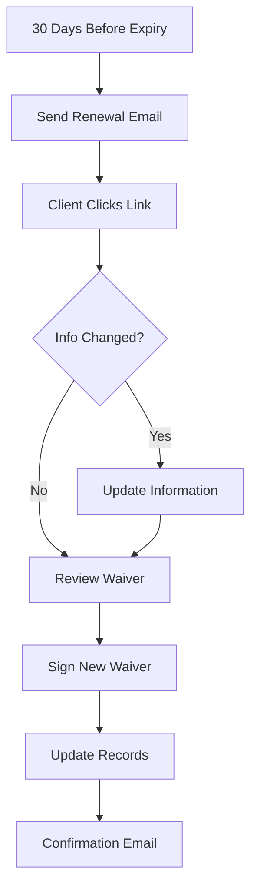

# Trial Client Intake & Digital Waiver System

## Overview
This document details the implementation specifications for the trial client intake questionnaire and digital waiver management system, including database schema, API endpoints, and user workflows.

## Table of Contents
1. [Trial Intake System](#trial-intake-system)
2. [Digital Waiver System](#digital-waiver-system)
3. [Database Schema](#database-schema)
4. [API Specifications](#api-specifications)
5. [User Workflows](#user-workflows)
6. [Security & Compliance](#security--compliance)

---

## Trial Intake System

### 1. Intake Form Structure

```typescript
interface TrialIntakeForm {
  // Personal Information
  personalInfo: {
    firstName: string;
    lastName: string;
    email: string;
    phone: string;
    dateOfBirth: Date;
    gender?: 'male' | 'female' | 'other' | 'prefer_not_to_say';
    address: {
      street: string;
      city: string;
      province: string;
      postalCode: string;
    };
    emergencyContact: {
      name: string;
      phone: string;
      relationship: string;
    };
  };

  // Health & Medical Information
  healthInfo: {
    // Medical conditions checklist
    medicalConditions: Array<{
      condition: MedicalCondition;
      details?: string;
    }>;
    
    // Current medications
    medications: Array<{
      name: string;
      purpose?: string;
      frequency?: string;
    }>;
    
    // Injuries or physical limitations
    injuries: Array<{
      type: string;
      date?: Date;
      currentStatus: 'healed' | 'ongoing' | 'recovering';
      limitations?: string;
    }>;
    
    // Specific health questions
    pregnancy: {
      currently: boolean;
      dueDate?: Date;
      trimester?: 1 | 2 | 3;
    };
    
    heartConditions: boolean;
    highBloodPressure: boolean;
    breathingDifficulties: boolean;
    jointProblems: string[];
    
    // Physician information
    physician: {
      hasPhysician: boolean;
      name?: string;
      phone?: string;
      clearanceRequired: boolean;
      clearanceProvided: boolean;
    };
  };

  // Fitness Goals & Preferences
  fitnessInfo: {
    // Current fitness level
    currentActivityLevel: 'sedentary' | 'lightly_active' | 'moderately_active' | 'very_active';
    exerciseFrequency: 'none' | '1-2_week' | '3-4_week' | '5+_week';
    
    // Goals (multiple selection)
    primaryGoals: Array<
      'weight_loss' | 'muscle_gain' | 'flexibility' | 
      'stress_relief' | 'rehabilitation' | 'general_fitness' |
      'sport_specific' | 'social' | 'other'
    >;
    
    goalDetails?: string;
    targetTimeframe?: '1_month' | '3_months' | '6_months' | '1_year';
    
    // Class preferences
    classPreferences: {
      types: Array<'yoga' | 'pilates' | 'strength' | 'cardio' | 'dance' | 'martial_arts' | 'meditation'>;
      intensity: 'low' | 'moderate' | 'high' | 'varied';
      groupSize: 'individual' | 'small_group' | 'large_group' | 'any';
    };
    
    // Availability
    availability: {
      preferredDays: Array<'monday' | 'tuesday' | 'wednesday' | 'thursday' | 'friday' | 'saturday' | 'sunday'>;
      preferredTimes: Array<'early_morning' | 'morning' | 'lunch' | 'afternoon' | 'evening'>;
      sessionsPerWeek: number;
    };
    
    // Experience with specific activities
    previousExperience: Array<{
      activity: string;
      level: 'beginner' | 'intermediate' | 'advanced';
      yearsExperience?: number;
    }>;
  };

  // Marketing & Referral Information
  marketingInfo: {
    source: 'google' | 'social_media' | 'referral' | 'walk_by' | 'event' | 'other';
    specificSource?: string;
    
    referral?: {
      referrerName: string;
      referrerEmail?: string;
      relationship: 'friend' | 'family' | 'coworker' | 'current_client' | 'other';
    };
    
    interests: {
      newsletter: boolean;
      promotions: boolean;
      workshops: boolean;
      challenges: boolean;
    };
  };

  // Trial Package Selection
  trialPackage: {
    packageId: string;
    startDate: Date;
    paymentMethod: 'credit_card' | 'debit' | 'cash' | 'e_transfer';
    agreedToTerms: boolean;
    timestamp: Date;
  };
}

// Medical condition enum
enum MedicalCondition {
  NONE = 'none',
  ASTHMA = 'asthma',
  DIABETES = 'diabetes',
  HEART_DISEASE = 'heart_disease',
  HIGH_BLOOD_PRESSURE = 'high_blood_pressure',
  ARTHRITIS = 'arthritis',
  BACK_PROBLEMS = 'back_problems',
  ANXIETY_DEPRESSION = 'anxiety_depression',
  CANCER = 'cancer',
  EPILEPSY = 'epilepsy',
  OTHER = 'other'
}
```

### 2. Trial Packages Configuration

```typescript
interface TrialPackage {
  id: string;
  name: string;
  description: string;
  duration: {
    value: number;
    unit: 'days' | 'weeks' | 'classes';
  };
  classes: {
    total: number;
    perWeek?: number;
  };
  pricing: {
    regularPrice: number;
    trialPrice: number;
    savingsPercent: number;
  };
  restrictions: {
    newClientsOnly: boolean;
    onePerClient: boolean;
    validityPeriod: number; // days to use after purchase
    classTypes?: string[]; // specific classes allowed
  };
  features: string[];
  popularFlag: boolean;
  sortOrder: number;
}

// Example trial packages
const trialPackages: TrialPackage[] = [
  {
    id: 'trial-single',
    name: 'Single Class Trial',
    description: 'Try any one class',
    duration: { value: 1, unit: 'classes' },
    classes: { total: 1 },
    pricing: {
      regularPrice: 25,
      trialPrice: 10,
      savingsPercent: 60
    },
    restrictions: {
      newClientsOnly: true,
      onePerClient: true,
      validityPeriod: 7
    },
    features: ['Any regular class', 'Meet the instructors', 'Tour the facility'],
    popularFlag: false,
    sortOrder: 1
  },
  {
    id: 'trial-week',
    name: 'One Week Unlimited',
    description: 'Unlimited classes for 7 days',
    duration: { value: 7, unit: 'days' },
    classes: { total: -1 }, // unlimited
    pricing: {
      regularPrice: 75,
      trialPrice: 25,
      savingsPercent: 67
    },
    restrictions: {
      newClientsOnly: true,
      onePerClient: true,
      validityPeriod: 14
    },
    features: ['Unlimited classes', 'Access to all class types', 'Free fitness consultation'],
    popularFlag: true,
    sortOrder: 2
  }
];
```

### 3. Intake Form Validation Rules

```typescript
const intakeValidationRules = {
  personalInfo: {
    age: {
      minimum: 16, // Under 16 requires guardian
      maximum: 100,
      guardianRequired: 18
    },
    phone: {
      format: /^\+?1?\d{10}$/,
      required: true
    },
    email: {
      format: /^[^\s@]+@[^\s@]+\.[^\s@]+$/,
      unique: true,
      required: true
    }
  },
  
  healthInfo: {
    medicalClearance: {
      requiredConditions: [
        'heart_disease',
        'high_blood_pressure',
        'diabetes',
        'pregnancy'
      ],
      ageThreshold: 65
    },
    emergencyContact: {
      required: true,
      cannotBeSelf: true
    }
  },
  
  consent: {
    termsAcceptance: {
      required: true,
      recordIP: true,
      recordTimestamp: true
    },
    marketingConsent: {
      required: false,
      separateOptIn: true
    }
  }
};
```

---

## Digital Waiver System

### 1. Waiver Template Structure

```typescript
interface WaiverTemplate {
  id: string;
  version: string;
  name: string;
  type: 'standard' | 'minor' | 'high_risk' | 'medical' | 'event';
  
  metadata: {
    createdAt: Date;
    updatedAt: Date;
    createdBy: string;
    approvedBy?: string;
    approvalDate?: Date;
    legalReviewDate?: Date;
    effectiveDate: Date;
    expiryMonths: number;
  };
  
  sections: WaiverSection[];
  
  signatureRequirements: {
    participant: SignatureRequirement;
    guardian?: SignatureRequirement;
    witness?: SignatureRequirement;
  };
  
  customFields?: CustomField[];
  
  settings: {
    renewalRequired: boolean;
    renewalPeriodDays: number;
    reminderDays: number[];
    autoExpiry: boolean;
    requirePhotoID: boolean;
    requireMedicalClearance?: boolean;
  };
}

interface WaiverSection {
  id: string;
  title: string;
  content: string; // HTML or Markdown
  type: 'acknowledgment' | 'release' | 'medical' | 'photo_release' | 'custom';
  required: boolean;
  order: number;
  
  conditionalDisplay?: {
    field: string;
    operator: 'equals' | 'contains' | 'greater_than' | 'less_than';
    value: any;
  };
}

interface SignatureRequirement {
  required: boolean;
  type: 'drawn' | 'typed' | 'upload';
  fields: {
    fullName: boolean;
    date: boolean;
    relationship?: boolean;
    witness?: boolean;
  };
}

interface CustomField {
  id: string;
  label: string;
  type: 'text' | 'number' | 'date' | 'checkbox' | 'select';
  required: boolean;
  options?: string[];
  validation?: any;
}
```

### 2. Waiver Signing Process

```typescript
interface WaiverSigningSession {
  sessionId: string;
  waiverTemplateId: string;
  participantId: string;
  
  status: 'draft' | 'in_progress' | 'completed' | 'expired';
  
  startedAt: Date;
  completedAt?: Date;
  expiresAt: Date;
  
  device: {
    userAgent: string;
    ipAddress: string;
    location?: {
      latitude: number;
      longitude: number;
    };
  };
  
  responses: {
    sections: {
      [sectionId: string]: {
        acknowledged: boolean;
        timestamp: Date;
      };
    };
    customFields: {
      [fieldId: string]: any;
    };
  };
  
  signatures: {
    participant?: SignatureData;
    guardian?: SignatureData;
    witness?: SignatureData;
  };
  
  documents: {
    photoId?: DocumentUpload;
    medicalClearance?: DocumentUpload;
  };
}

interface SignatureData {
  type: 'drawn' | 'typed' | 'uploaded';
  data: string; // Base64 for drawn, text for typed, URL for uploaded
  signedAt: Date;
  fullName: string;
  relationship?: string;
  ipAddress: string;
  
  verification?: {
    method: 'sms' | 'email';
    verified: boolean;
    verifiedAt?: Date;
  };
}

interface DocumentUpload {
  filename: string;
  mimeType: string;
  size: number;
  url: string;
  uploadedAt: Date;
  verified?: boolean;
  verifiedBy?: string;
  verifiedAt?: Date;
}
```

### 3. Waiver Storage & Compliance

```typescript
interface WaiverRecord {
  id: string;
  participantId: string;
  templateId: string;
  templateVersion: string;
  
  signedAt: Date;
  expiresAt: Date;
  
  status: 'active' | 'expired' | 'revoked' | 'superseded';
  
  data: {
    responses: any;
    signatures: SignatureData[];
    customFields: any;
  };
  
  encryption: {
    method: 'AES-256-GCM';
    keyId: string;
    encrypted: boolean;
  };
  
  compliance: {
    retentionPeriod: number; // years
    purgeDate?: Date;
    legalHold?: boolean;
    auditLog: AuditEntry[];
  };
  
  metadata: {
    sessionId: string;
    device: any;
    location?: any;
    duration: number; // seconds to complete
  };
}

interface AuditEntry {
  action: 'created' | 'viewed' | 'updated' | 'printed' | 'shared' | 'expired';
  userId: string;
  timestamp: Date;
  ipAddress: string;
  reason?: string;
}
```

---

## Database Schema

### 1. Trial Intake Tables

```sql
-- Trial intake responses
CREATE TABLE trial_intake_responses (
    id UUID PRIMARY KEY DEFAULT gen_random_uuid(),
    
    -- Personal info (encrypted)
    personal_info JSONB NOT NULL,
    
    -- Health info (encrypted)
    health_info JSONB NOT NULL,
    
    -- Fitness goals
    fitness_info JSONB NOT NULL,
    
    -- Marketing info
    marketing_info JSONB NOT NULL,
    
    -- Selected package
    trial_package_id UUID REFERENCES trial_packages(id),
    
    -- Status tracking
    status VARCHAR(50) DEFAULT 'pending', -- pending, approved, rejected, converted
    
    -- Conversion tracking
    converted_to_member BOOLEAN DEFAULT FALSE,
    converted_at TIMESTAMP WITH TIME ZONE,
    conversion_package_id UUID,
    
    -- Metadata
    submitted_at TIMESTAMP WITH TIME ZONE DEFAULT NOW(),
    ip_address INET,
    user_agent TEXT,
    
    -- Follow-up tracking
    follow_up_status JSONB DEFAULT '{}',
    
    created_at TIMESTAMP WITH TIME ZONE DEFAULT NOW(),
    updated_at TIMESTAMP WITH TIME ZONE DEFAULT NOW()
);

-- Trial packages configuration
CREATE TABLE trial_packages (
    id UUID PRIMARY KEY DEFAULT gen_random_uuid(),
    studio_id UUID REFERENCES studios(id),
    
    name VARCHAR(100) NOT NULL,
    description TEXT,
    
    -- Package details
    duration_value INTEGER NOT NULL,
    duration_unit VARCHAR(20) NOT NULL, -- days, weeks, classes
    total_classes INTEGER, -- -1 for unlimited
    classes_per_week INTEGER,
    
    -- Pricing
    regular_price DECIMAL(10, 2) NOT NULL,
    trial_price DECIMAL(10, 2) NOT NULL,
    
    -- Restrictions
    new_clients_only BOOLEAN DEFAULT TRUE,
    one_per_client BOOLEAN DEFAULT TRUE,
    validity_days INTEGER DEFAULT 30,
    allowed_class_types TEXT[],
    
    -- Display
    features JSONB DEFAULT '[]',
    popular BOOLEAN DEFAULT FALSE,
    sort_order INTEGER DEFAULT 0,
    active BOOLEAN DEFAULT TRUE,
    
    created_at TIMESTAMP WITH TIME ZONE DEFAULT NOW(),
    updated_at TIMESTAMP WITH TIME ZONE DEFAULT NOW()
);

-- Trial conversions tracking
CREATE TABLE trial_conversions (
    id UUID PRIMARY KEY DEFAULT gen_random_uuid(),
    intake_response_id UUID REFERENCES trial_intake_responses(id),
    client_id UUID REFERENCES clients(id),
    
    trial_start_date DATE NOT NULL,
    trial_end_date DATE NOT NULL,
    
    -- Attendance tracking
    classes_attended INTEGER DEFAULT 0,
    first_class_date DATE,
    last_class_date DATE,
    
    -- Conversion details
    converted BOOLEAN DEFAULT FALSE,
    conversion_date DATE,
    membership_type VARCHAR(50),
    membership_id UUID,
    
    -- Financial
    trial_revenue DECIMAL(10, 2),
    lifetime_value DECIMAL(10, 2),
    
    -- Attribution
    attributed_to_trainer UUID REFERENCES trainers(id),
    attributed_to_campaign VARCHAR(100),
    
    created_at TIMESTAMP WITH TIME ZONE DEFAULT NOW()
);
```

### 2. Digital Waiver Tables

```sql
-- Waiver templates
CREATE TABLE waiver_templates (
    id UUID PRIMARY KEY DEFAULT gen_random_uuid(),
    studio_id UUID REFERENCES studios(id),
    
    name VARCHAR(100) NOT NULL,
    type VARCHAR(50) NOT NULL, -- standard, minor, high_risk, medical, event
    version VARCHAR(20) NOT NULL,
    
    -- Content
    sections JSONB NOT NULL, -- Array of sections with content
    custom_fields JSONB DEFAULT '[]',
    
    -- Metadata
    created_by UUID REFERENCES users(id),
    approved_by UUID REFERENCES users(id),
    approval_date DATE,
    legal_review_date DATE,
    effective_date DATE NOT NULL,
    expiry_months INTEGER DEFAULT 12,
    
    -- Settings
    settings JSONB DEFAULT '{}',
    
    -- Status
    status VARCHAR(50) DEFAULT 'draft', -- draft, active, archived
    
    created_at TIMESTAMP WITH TIME ZONE DEFAULT NOW(),
    updated_at TIMESTAMP WITH TIME ZONE DEFAULT NOW(),
    
    UNIQUE(studio_id, name, version)
);

-- Signed waivers
CREATE TABLE signed_waivers (
    id UUID PRIMARY KEY DEFAULT gen_random_uuid(),
    template_id UUID REFERENCES waiver_templates(id),
    template_version VARCHAR(20) NOT NULL,
    participant_id UUID REFERENCES clients(id),
    
    -- Signing session
    session_id UUID NOT NULL,
    
    -- Encrypted waiver data
    waiver_data JSONB NOT NULL, -- Encrypted JSON with all responses and signatures
    
    -- Signature data (encrypted)
    signatures JSONB NOT NULL,
    
    -- Status
    status VARCHAR(50) DEFAULT 'active', -- active, expired, revoked, superseded
    signed_at TIMESTAMP WITH TIME ZONE NOT NULL,
    expires_at TIMESTAMP WITH TIME ZONE NOT NULL,
    
    -- Compliance
    retention_until DATE NOT NULL,
    legal_hold BOOLEAN DEFAULT FALSE,
    
    -- Metadata
    device_info JSONB,
    location JSONB,
    duration_seconds INTEGER,
    
    created_at TIMESTAMP WITH TIME ZONE DEFAULT NOW(),
    
    INDEX idx_waiver_participant (participant_id, expires_at),
    INDEX idx_waiver_status (status, expires_at)
);

-- Waiver audit log
CREATE TABLE waiver_audit_log (
    id UUID PRIMARY KEY DEFAULT gen_random_uuid(),
    waiver_id UUID REFERENCES signed_waivers(id),
    
    action VARCHAR(50) NOT NULL, -- created, viewed, updated, printed, shared, expired
    user_id UUID REFERENCES users(id),
    
    details JSONB,
    ip_address INET,
    user_agent TEXT,
    
    created_at TIMESTAMP WITH TIME ZONE DEFAULT NOW(),
    
    INDEX idx_waiver_audit (waiver_id, created_at)
);

-- Guardian signatures for minors
CREATE TABLE guardian_signatures (
    id UUID PRIMARY KEY DEFAULT gen_random_uuid(),
    waiver_id UUID REFERENCES signed_waivers(id),
    
    guardian_name VARCHAR(255) NOT NULL,
    relationship VARCHAR(50) NOT NULL,
    
    -- Encrypted signature data
    signature_data JSONB NOT NULL,
    
    -- Verification
    verified BOOLEAN DEFAULT FALSE,
    verification_method VARCHAR(50),
    verified_at TIMESTAMP WITH TIME ZONE,
    
    signed_at TIMESTAMP WITH TIME ZONE DEFAULT NOW()
);
```

---

## API Specifications

### 1. Trial Intake Endpoints

```typescript
// POST /api/trial/intake
interface SubmitIntakeRequest {
  personalInfo: PersonalInfo;
  healthInfo: HealthInfo;
  fitnessInfo: FitnessInfo;
  marketingInfo: MarketingInfo;
  selectedPackageId: string;
  agreedToTerms: boolean;
}

interface SubmitIntakeResponse {
  intakeId: string;
  status: 'pending_review' | 'approved' | 'requires_medical';
  nextSteps: {
    waiverRequired: boolean;
    waiverUrl?: string;
    paymentRequired: boolean;
    paymentUrl?: string;
    bookingUrl?: string;
  };
}

// GET /api/trial/packages
interface GetTrialPackagesResponse {
  packages: TrialPackage[];
  recommendedPackageId?: string;
}

// POST /api/trial/book-class
interface BookTrialClassRequest {
  intakeId: string;
  classId: string;
  paymentMethodId?: string;
}

// GET /api/trial/conversion-stats
interface ConversionStatsResponse {
  totalTrials: number;
  conversions: number;
  conversionRate: number;
  averageLifetimeValue: number;
  topConversionFactors: string[];
}
```

### 2. Waiver Endpoints

```typescript
// GET /api/waivers/templates
interface GetWaiverTemplatesResponse {
  templates: WaiverTemplate[];
}

// POST /api/waivers/start-session
interface StartWaiverSessionRequest {
  templateId: string;
  participantEmail: string;
  participantInfo?: {
    firstName: string;
    lastName: string;
    dateOfBirth: Date;
  };
}

interface StartWaiverSessionResponse {
  sessionId: string;
  sessionUrl: string;
  expiresAt: Date;
}

// POST /api/waivers/sign
interface SignWaiverRequest {
  sessionId: string;
  responses: {
    sections: { [sectionId: string]: boolean };
    customFields: { [fieldId: string]: any };
  };
  signatures: {
    participant: SignatureData;
    guardian?: SignatureData;
  };
}

interface SignWaiverResponse {
  waiverId: string;
  status: 'completed' | 'requires_guardian' | 'requires_verification';
  expiresAt: Date;
  downloadUrl: string;
}

// GET /api/waivers/check-status
interface CheckWaiverStatusRequest {
  clientId: string;
  templateType?: string;
}

interface CheckWaiverStatusResponse {
  hasValidWaiver: boolean;
  waivers: Array<{
    id: string;
    templateName: string;
    signedAt: Date;
    expiresAt: Date;
    status: string;
  }>;
}
```

---

## User Workflows

### 1. New Client Trial Journey

```mermaid
graph TD
    A[Visit Website] --> B[Click "Try Us Out"]
    B --> C[Fill Intake Form]
    C --> D{Medical Clearance Required?}
    D -->|Yes| E[Upload Medical Clearance]
    D -->|No| F[Select Trial Package]
    E --> F
    F --> G[Make Payment]
    G --> H[Sign Digital Waiver]
    H --> I[Book First Class]
    I --> J[Receive Confirmation Email]
    J --> K[Attend First Class]
    K --> L[Post-Class Follow-up]
    L --> M{Convert to Member?}
    M -->|Yes| N[Select Membership]
    M -->|No| O[Nurture Campaign]
```

### 2. Waiver Renewal Flow



---

## Security & Compliance

### 1. Data Protection

```typescript
// Encryption service for sensitive data
class IntakeEncryptionService {
  private keyProvider: KeyProvider;
  
  async encryptIntakeData(data: TrialIntakeForm): Promise<EncryptedData> {
    const sensitiveFields = [
      'personalInfo',
      'healthInfo',
      'emergencyContact'
    ];
    
    const encrypted: any = { ...data };
    
    for (const field of sensitiveFields) {
      if (data[field]) {
        encrypted[field] = await this.encrypt(
          JSON.stringify(data[field]),
          `intake-${field}`
        );
      }
    }
    
    return encrypted;
  }
  
  private async encrypt(data: string, context: string): Promise<string> {
    const key = await this.keyProvider.getKey(context);
    return crypto.encrypt(data, key);
  }
}
```

### 2. Compliance Requirements

```yaml
PIPEDA Compliance:
  - Explicit consent for data collection
  - Clear purpose statements
  - Data minimization
  - Access to personal data on request
  - Ability to correct information
  - Secure storage and transmission

HIPAA Considerations:
  - Encryption of health information
  - Access controls
  - Audit logging
  - Breach notification procedures
  - Business Associate Agreements

Waiver Legal Requirements:
  - Clear, unambiguous language
  - Conspicuous placement
  - Voluntary agreement
  - Age verification
  - Guardian consent for minors
  - Retention per provincial law (typically 7 years)
```

### 3. Audit Trail

```typescript
// Comprehensive audit logging
class IntakeAuditLogger {
  async logIntakeEvent(event: {
    intakeId: string;
    action: string;
    userId?: string;
    metadata?: any;
  }): Promise<void> {
    await db.auditLog.create({
      entityType: 'trial_intake',
      entityId: event.intakeId,
      action: event.action,
      userId: event.userId || 'system',
      metadata: {
        ...event.metadata,
        ip: this.getClientIP(),
        userAgent: this.getUserAgent(),
        timestamp: new Date()
      }
    });
  }
}
```

---

## Implementation Priority

### Phase 1 (MVP - 4 weeks)
1. Basic intake form with essential fields
2. Simple waiver template (standard adult)
3. Database schema implementation
4. Basic API endpoints
5. Email notifications

### Phase 2 (Enhanced - 4 weeks)
1. Advanced health screening
2. Multiple waiver templates
3. Guardian signatures
4. Trial package management
5. Conversion tracking

### Phase 3 (Optimization - 4 weeks)
1. A/B testing framework
2. Advanced analytics
3. Automated follow-up campaigns
4. Integration with CRM
5. Mobile optimization